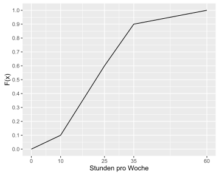

### Aufgabe 1.2

Im Rahmen einer Studie zum Thema "Gesundheit und Studium" wurden 150
Studenten über die Häufigkeit ihrer sportlichen Betätigung, gemessen in
Studen pro Monat befragt. Das Ergebnis der Befragung wird durch folgende
*empirische Verteilungsfunktion* wiedergegeben.

#### Frage 1

Bestimmen Sie die relativen Häufigkeiten (\\(p\_j\\)) der vier Klassen
\\(j = 1, , 4\\).

#### Frage 2

Welche der folgenden Aussagen ist richtig

-   A: Das 30%-Quantil wird von 30% der Beobachtungen überschritten.
-   B: 70% der Beobachtungen nehmen einen Wert an, der mindestens so
    groß wie das 30% Quantil ist.
-   C: Das 30% Quantil wird von 30% der Beobachtungen unterschritten.
-   D: In dieser Stichprobe nimmt das 30% Quantil einen Wert von 45
    (=0, 3 \* 150) an.
-   E: Das 30% Quantil ist stets kleiner als der Median.

#### Frage 3

In welcher Klasse befindet sich das 30% Quantil?

-   A: \[0 - 10\[
-   B: \[10 - 25\[
-   C: \[25 - 35\[
-   D: \[35 - 60\]
